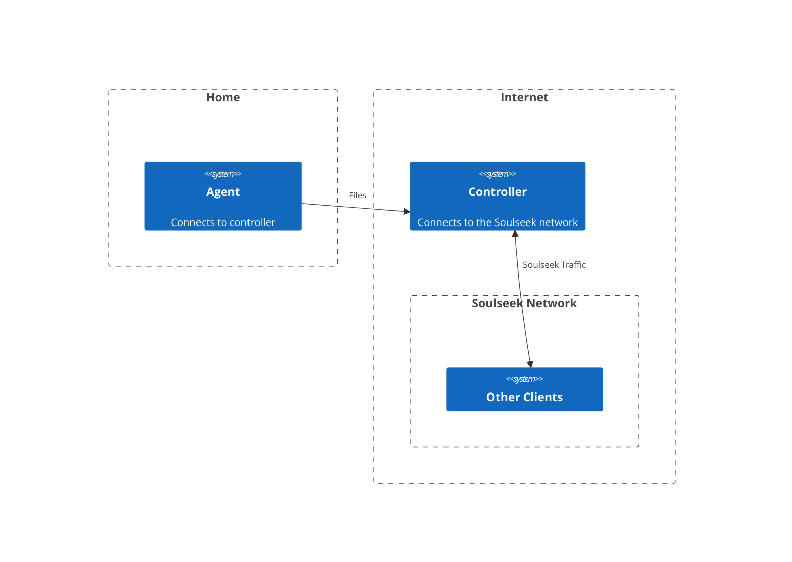

# Relay Mode

## What is Relay Mode?

Relay mode refers to an optional configuration that allows two or more instances of slskd to work together over a network as one client.

A relay configuration consists of one **Controller** and one or more **Agents**.  

The controller is the instance that connects to the Soulseek network and acts as the client; it's pretty much a standard instance of slskd.  Agents are additional instances that connect to the controller, instead of the Soulseek network.  These instances only relay files to the controller.

You can think of Relay agents as 'remote storage' for slskd.

Here's an example of a Relay configuration with one agents running in a user's home and a controller that's running on a server somewhere in the cloud:




## Why use Relay Mode?

There's a number of reasons someone would want to use Relay mode:

* You want to serve files from multiple locations, but don't want to have multiple Soulseek logins
* You are concerned about privacy and don't want to use (or don't trust) a VPN
* You want to want full functionality on the Soulseek network but can't configure port forwarding properly
* You are a high volume user and want to offload bandwidth from your home internet connection
* You want an always-on Soulseek client to preserve your place in remote queues, and don't have an always-on client at home

For most of these use cases you can simply run an instance of slskd in the cloud, but that can get expensive and painful to manage if you're sharing a large number of files and/or add new files to your shares regularly.  With a Relay you can point an agent to your local files and connect it to your cloud instance and get the best of both worlds.

## Is Relay Mode Secure?

Extra secure!  

All traffic between the Relay controller and agents is (optionally) sent over HTTPS, meaning it is end to end encrypted.

Agents connect to the controller, not the other way around, meaning your home network doesn't need to forward any ports or enable any additional incoming traffic through firewalls.  The only trust involved is in the address of the controller, which you control.

All incoming requests to the controller must be secured with an API key, and each agent is configured with an additional shared secret to ensure authenticity.  Agent configuration and API keys can be scoped to a specific IP address or CIDR block to ensure only authorized agents can connect, even if API keys and shared secrets are obtained by an attacker.

## Quick Start

To start, you'll need two instances of slskd running on two different machines. Determine which is the controller (the instance that will connect to the Soulseek network) and which is the agent (the instance that will connect to the controller).

Next, generate two secrets with length between 16 and 255 characters; one to use as an API key, and another to use as the shared Relay secret. Use your favorite secret/password generator, or use slskd by running:

```bash
./slskd --generate-secret 32
```

For this example we'll use `9tWy5c3NrmekKVWLQXBztz0hY7rNGlj1tGMfvHKmU1q` for the API key, and `BgI04SuVtsAYipxPHDpdxJsnVoPEeq4tKJeorWxr3Pj` for the shared secret.

> Note: DO NOT copy/paste these values into your configuration! Use your own values, or you're opening yourself up to an attack!

### Controller

Next, we'll configure the controller.  We'll enable the Relay, set this instance's mode to `controller`, and configure a single agent named `example_agent`.  We'll accept connections from within our home network, which uses IP addresses in the 192.168.1.x range.

We'll also need to create an API key, which we'll allow to be used from anywhere.  We'll give the key the role `readwrite`, which is required for agents.

Here's the entire `slskd.yml` file; feel free to copy and paste it over the contents of your file if you're following along (just replace the Soulseek credentials with your own):

```yaml
instance_name: controller
relay:
  enabled: true
  mode: controller
  agents:
    example:
      instance_name: example_agent
      secret: BgI04SuVtsAYipxPHDpdxJsnVoPEeq4tKJeorWxr3Pj
      cidr: 192.168.1.0/24
web:
  authentication:
    api_keys:
      example_api_key:
        key: 9tWy5c3NrmekKVWLQXBztz0hY7rNGlj1tGMfvHKmU1q
        role: readwrite
        cidr: 192.168.1.0/24
soulseek:
  username: <your username>
  password: <your password>
```

We'll start the controller instance, which, in my case, is running on a machine with IP address `192.168.1.241`.  We should see the following logs (among many others):

```
[16:15:48 INF] Running in Controller relay mode.  Listening for incoming Agent connections.
```

### Agent

Finally, we'll configure the agent.  We'll enable the Relay, set this instance's mode to `agent`, and fill in the details of or controller.

The controller is running on a machine with IP address 192.168.1.53, and we want to use HTTPS, so we'll use the URL `https://192.168.1.53:5031`.  We're using the default self-signed certificate, so we'll need to `ignore_certificate_errors`.

We'll copy the API key and secret from the controller config, and lastly, we want the agent to receive the files downloaded by the controller, so we'll set `downloads` to `true`.

Agents must also set their instance name to the corresponding agent name in the controller.  We configured `example` above, so this instance needs to be named `example`, as well.

To demonstrate how file relays work, I've created a file `foo.txt` in `~/Music/test`, and I'll configure that directory as a share (`/home/kubuntu/Music` in my case).

The entire `slskd.yml` file is below if you'd like to copy/paste it. Be sure to update the controller's address to the IP address of the machine the controller is working on.

```yaml
instance_name: example_agent
relay:
  enabled: true
  mode: agent
  controller:
    address: https://192.168.1.241:5031
    ignore_certificate_errors: true
    api_key: 9tWy5c3NrmekKVWLQXBztz0hY7rNGlj1tGMfvHKmU1q
    secret: BgI04SuVtsAYipxPHDpdxJsnVoPEeq4tKJeorWxr3Pj
    downloads: true
shares:
  directories:
    - /home/kubuntu/Music
```

We'll start the agent and confirm that it connects to the controller and uploads its shares (only pertinent logs shown):

```
[18:50:08 INF] Running in Agent relay mode; not connecting to the Soulseek server.
[18:50:08 INF] Attempting to connect to the relay controller https://192.168.1.241:5031
[18:50:09 INF] Relay controller connection established. Awaiting authentication...
[18:50:09 INF] Authenticated. Uploading shares...
[18:50:09 INF] Beginning upload of shares (48.0 KB)
[18:50:10 INF] Upload of shares succeeded (48.0 KB in 136ms)
[18:50:10 INF] Shares uploaded. Ready to upload files.
```

The controller should show logs similar to the following:

```
[19:09:30 INF] Agent connection GyBMnXHfdomNzR2FEzT68Q from 192.168.1.250 established. Sending authentication challenge GU7pSFTG60skUtqM24FfB2WiUnWsC1LxYagBsz7edcp...
[19:09:30 INF] Agent connection GyBMnXHfdomNzR2FEzT68Q from 192.168.1.250 authenticated as agent example_agent
[19:09:31 INF] Agent example_agent (connection GyBMnXHfdomNzR2FEzT68Q) from 192.168.1.250 requested share upload token f81eb299-1a86-4f72-a77c-922d3f73106f
[19:09:31 INF] Handling share upload (f81eb299-1a86-4f72-a77c-922d3f73106f) from a caller claiming to be agent example_agent
[19:09:31 INF] Agent example_agent authenticated for token f81eb299-1a86-4f72-a77c-922d3f73106f. Beginning download of shares to /tmp/slskd/share_example_h0ycner1.svm.db
[19:09:31 INF] Download of shares from example_agent (f81eb299-1a86-4f72-a77c-922d3f73106f) complete (48.0 KB in 2ms)
[19:09:31 INF] Loading shares from agent example_agent
[19:09:31 INF] Warming browse response cache...
[19:09:31 INF] Shares from agent example_agent ready.
[19:09:31 INF] Browse response cached successfully in 25ms
```

We're now ready to relay files!

### Testing

From another machine running a different Soulseek client, download the `foo.txt` file we shared as a test.  The controller should show logs similar to the following:

```
[19:19:34 INF] Resolved Music\test\foo.txt to physical file /home/kubuntu/Music/test/foo.txt on host 'example_agent'
[19:19:35 INF] Requested file Music\test\foo.txt from Agent example_agent with ID 09e76dde-c4fa-4c50-8c25-d92a26b52102. Waiting for incoming connection.
[19:19:35 INF] Handling file upload of Music\test\foo.txt (09e76dde-c4fa-4c50-8c25-d92a26b52102) from a caller claiming to be agent example_agent
[19:19:35 INF] Agent example_agent authenticated for token 09e76dde-c4fa-4c50-8c25-d92a26b52102. Forwarding file stream for Music\test\foo.txt
[19:19:35 INF] Agent example_agent provided file stream for file Music\test\foo.txt with ID 09e76dde-c4fa-4c50-8c25-d92a26b52102
[19:19:35 INF] File upload of Music\test\foo.txt (09e76dde-c4fa-4c50-8c25-d92a26b52102) from agent example_agent complete
```

And the agent should show:

```
[19:19:34 INF] Relay controller requested file info for Music\test\foo.txt with ID 468a42b3-e0ce-4562-850a-75dea2fd5701
[19:19:35 INF] Relay controller requested file Music\test\foo.txt with ID 09e76dde-c4fa-4c50-8c25-d92a26b52102
[19:19:35 INF] Beginning upload of file Music\test\foo.txt with ID 09e76dde-c4fa-4c50-8c25-d92a26b52102
[19:19:35 INF] Upload of file Music\test\foo.txt with ID 09e76dde-c4fa-4c50-8c25-d92a26b52102 succeeded.
```

If the download completes and you see logs in the controller and agent that look similar to what's shown here, everything is working!