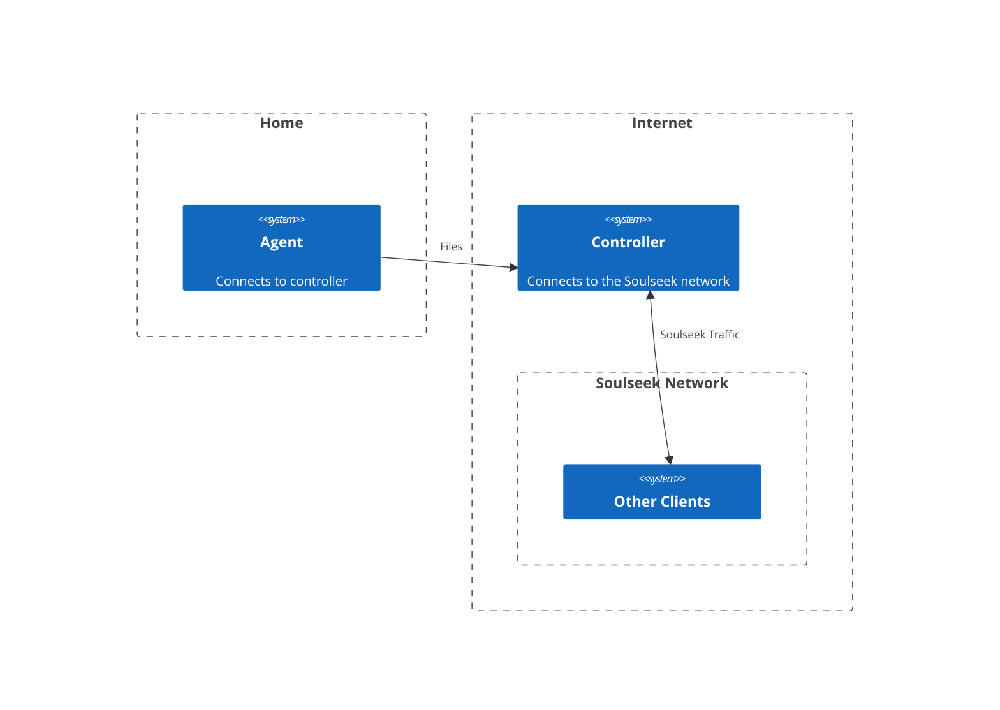

# Relay Mode

## What is Relay Mode?

Relay mode refers to an optional configuration that allows two or more instances of slskd to work together over a network as one client.

A relay configuration consists of one **Controller** and one or more **Agents**.  

The controller is the instance that connects to the Soulseek network and acts as the client; it's pretty much a standard instance of slskd.  Agents are additional instances that connect to the controller, instead of the Soulseek network.  These instances only relay files to the controller.

You can think of Relay agents as 'remote storage' for slskd.

Here's an example of a Relay configuration with one agents running in a user's home and a controller that's running on a server somewhere in the cloud:

## Why use Relay Mode?

There's a number of reasons someone would want to use Relay mode:

* You want to serve files from multiple locations, but don't want to have multiple Soulseek logins
* You are concerned about privacy and don't want to use (or don't trust) a VPN
* You want to want full functionality on the Soulseek network but can't configure port forwarding properly
* You are a high volume user and want to offload bandwidth from your home internet connection
* You want an always-on Soulseek client to preserve your place in remote queues, and don't have an always-on client at home

For most of these use cases you can simply run an instance of slskd in the cloud, but that can get expensive and painful to manage if you're sharing a large number of files and/or add new files to your shares regularly.  With a Relay you can point an agent to your local files and connect it to your cloud instance and get the best of both worlds.

## Is Relay Mode Secure?

Extra secure!  

All traffic between the Relay controller and agents is (optionally) sent over HTTPS, meaning it is end to end encrypted.

Agents connect to the controller, not the other way around, meaning your home network doesn't need to forward any ports or enable any additional incoming traffic through firewalls.  The only trust involved is in the address of the controller, which you control.

All incoming requests to the controller must be secured with an API key, and each agent is configured with an additional shared secret to ensure authenticity.  Agent configuration and API keys can be scoped to a specific IP address or CIDR block to ensure only authorized agents can connect, even if API keys and shared secrets are obtained by an attacker.

## Quick Start

<how to config the controller>
<how to config the agent>

## How it Works

<technical details>